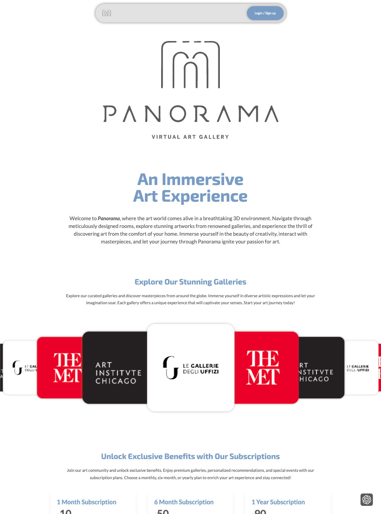
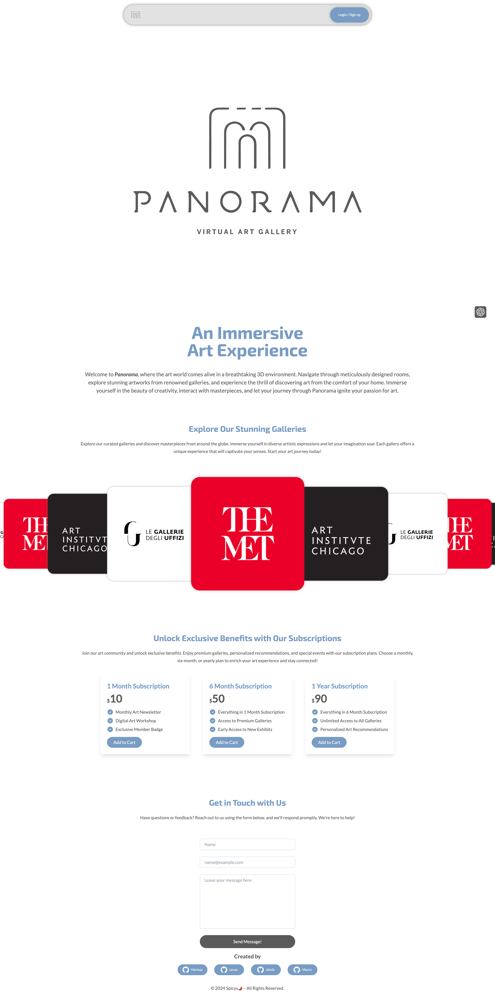
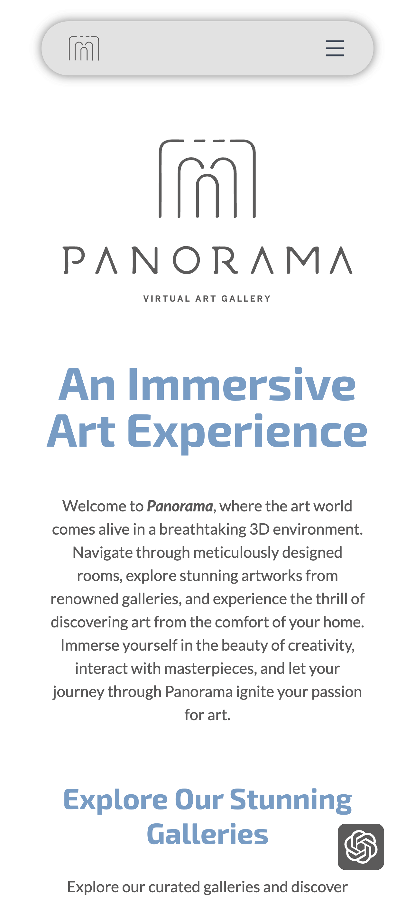
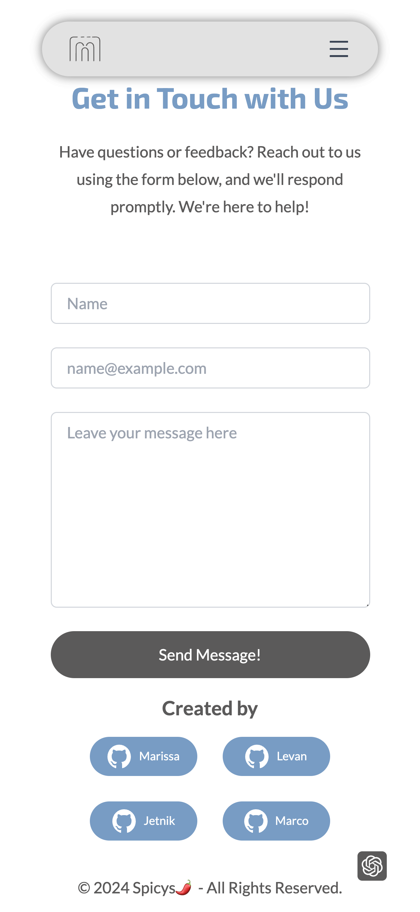

# Panorama

## Welcome

Welcome to Panorama, where art meets technology to provide you with an unparalleled virtual gallery experience. Our innovative platform allows you to explore, interact with, and purchase high-resolution artworks from the comfort of your home.

## Description

Panorama is a cutting-edge virtual 3D art gallery that enables users to explore, interact with, and purchase high-resolution artworks from renowned APIs such as the Met, Uffizi, and Chicago Art Institute. This immersive application offers a realistic gallery experience with intuitive navigation, detailed artwork information, and robust accessibility features. Users can unlock exclusive benefits through our subscription plans.

## Table of Contents

- [Features](#features)
- [Technology Stack](#technology-stack)
- [Getting Started](#getting-started)
  - [Prerequisites](#prerequisites)
  - [Installation](#installation)
  - [Usage](#usage)
- [Contributing](#contributing)
- [Deployment](#deployment)
- [Authors and Acknowledgments](#authors-and-acknowledgments)
- [License](#license)
- [User Story](#user-story)
- [Motivation](#motivation)
- [Key Features](#key-features)
- [Challenges and Solutions](#challenges-and-solutions)
- [Future Development](#future-development)

## Features

- **User Authentication:** Secure sign-up and login functionality, including session management.
- **Immersive 3D Gallery:** Navigate and explore a realistic virtual art gallery using WASD keys and the mouse.
- **High-Resolution Artworks:** View detailed high-resolution images of artworks.
- **Interactive Experience:** Click on artworks for detailed information and save favorites.
- **Secure Transactions:** Purchase art pieces securely using Stripe.
- **Subscription Plans:** Access premium features and exclusive content through subscription plans.
- **Enhanced Interaction:** Use OpenAI for additional information about artworks.
- **PWA Features:** Offline functionality and improved performance through PWA implementation.

## Technology Stack

- **Frontend:** React.js, Three.js, Tailwind CSS, Bootstrap
- **Backend:** Node.js, Express.js, GraphQL, MongoDB, Mongoose
- **Additional Tools:** Stripe for payments, JWT for authentication, OpenAI for enhanced user interaction

## Getting Started

### Prerequisites

- **Node.js:** Ensure you have Node.js installed on your machine.
- **MongoDB:** Ensure MongoDB is installed and running.

### Installation

1. **Clone the repository:**

   ```bash
   git clone https://github.com/marphco/panorama.git
   ```

2. **Navigate to the project directory:**

   ```bash
    cd panorama
   ```

3. **Install dependencies:**

   ```bash
     npm install
   ```

4. **Copy the .env.EXAMPLE file to a new file named .env and update it with your specific environment variables.**

### Usage

1. **Start the server:**

   ```bash
    npm run dev
   ```

2. **Access the platform:**

   Open your web browser and visit http://localhost:3000 to explore Panorama's virtual gallery.

   If you see a welcome page or the main interface of the application, the server is running correctly!

   

## Contributing

Your contributions make this project better. If you have an idea for improving Panorama, please fork the repository and create a pull request, or open an issue with your suggestions. For substantial changes, please open an issue first to discuss what you would like to change.

## Deployment

This application is deployed on Heroku. You can access it [here](https://your-heroku-app-link).

## Authors and Acknowledgments

- **Levan:** Backend integration, API handling, MongoDB integration
- **Marco:** Frontend UI/UX, Three.js integration, Tailwind CSS, Bootstrap
- **Marissa:** Full Stack Development, Shop and Stripe checkout integration, PWA configuration
- **Jetnik:** Full Stack Development, API handling, Tailwind CSS, OpenAI integration

Special thanks to everyone who has contributed to making this project a success.

## License

This project is licensed under the Apache License Version 2.0, January 2004.

## User Story

As an art enthusiast, you can explore a virtual 3D art gallery to view, interact with, and purchase high-resolution artworks in an immersive environment. Navigate using WASD keys and the mouse, click on artworks for detailed information, save your favorite pieces, and complete purchases. The app offers a smooth, responsive experience with robust error handling and accessibility features, using OpenAI to provide additional information about favorite portraits.

## Motivation

Panorama aims to bring the art gallery experience to users' homes by leveraging the latest web technologies. Our goal is to offer a unique and engaging way to appreciate and own art, regardless of physical location.

## Key Features

- **Immersive 3D Gallery:** Navigate and explore a realistic virtual art gallery.
- **High-Resolution Artworks:** View detailed high-resolution images of artworks.
- **Interactive Experience:** Click on artworks for detailed information and save favorites.
- **Secure Transactions:** Purchase art pieces securely using Stripe.
- **Subscription Plans:** Access premium features and exclusive content through subscription plans.
- **Enhanced Interaction:** Use OpenAI for additional information about artworks.

## Challenges and Solutions

- **Three.js Integration:** Created a seamless 3D experience using Three.js and React.
- **Smooth Navigation:** Ensured intuitive navigation and interaction within the 3D space.
- **High-Resolution Data Handling:** Efficiently managed and displayed high-resolution artwork data.
- **Backend Integration:** Implemented secure and efficient backend integration.
- **Checkout Process:** Managed the checkout process with Stripe for art purchases.
- **Subscription Management:** Implemented and managed different subscription plans and benefits.
- **PWA Implementation:** Configured the app as a Progressive Web App for offline functionality.

## Future Development

- **Enhanced Art Interaction:** Add features like virtual tours with guided narration and interactive art descriptions.
- **User-Generated Galleries:** Allow users to curate their own virtual galleries from the available artworks.
- **Social Features:** Enable users to share their favorite artworks and galleries on social media platforms.
- **Art Community:** Build a community platform within Panorama where users can discuss and review artworks.
- **Live Events:** Host live events such as artist talks, virtual openings, and interactive art workshops.
- **Enhanced Personalization:** Implement advanced AI algorithms to provide personalized art recommendations based on user preferences.

## Projects Screenshots





**© 2024 Spicys🌶️ - All Rights Reserved.**
